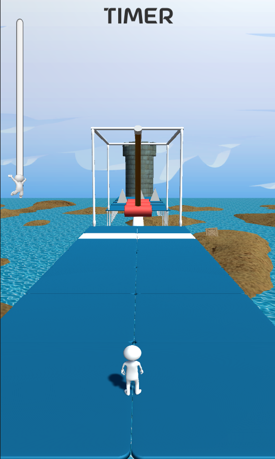
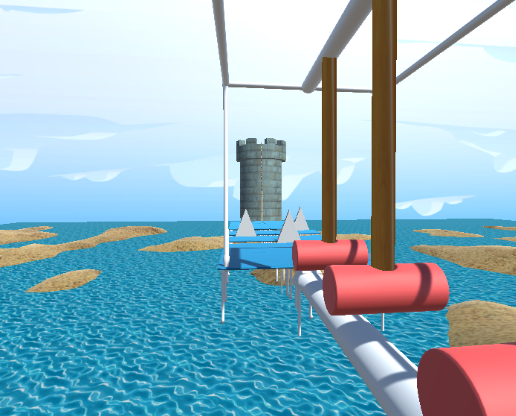
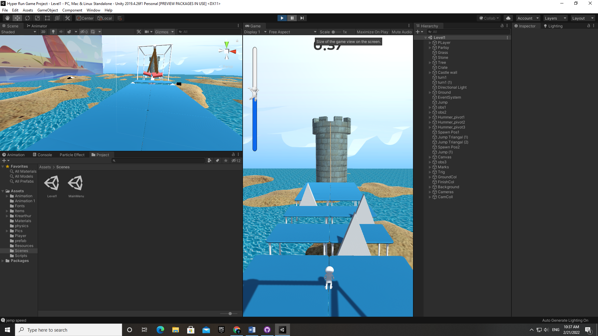

# 🏃 Hyper-Run-3D

A simple **hypercasual 3D game** built with **Unity** where the player runs through a level, avoids obstacles, and reaches the finish line.

---

##  Project Structure

```bash
Assets/
├── Animation/        # Game animations
├── Fonts/            # Fonts used in UI
├── Items/            # Collectible items & objects
├── Krearthur/        # Character/asset models
├── Materials/        # Materials used in the game
├── physics/          # Physics-related assets
├── Pics/             # Reference pictures
├── Player/           # Player-related models, prefabs, etc.
├── prefab/           # Prefabs for game objects
├── Resources/        # Resource files
├── Scenes/           # Game scenes (includes Level 1)
└── Scripts/          # Gameplay scripts (movement, obstacles, etc.)
GameImages/           # Screenshots for README
Packages/
ProjectSettings/
```

---

## Gameplay

- Player can **run through the level**  
- Avoid various **obstacles**  
- Reach the **finish line to complete the level**  

---

## Screenshots

Here are some preview images of the game:

  
  
  


---

## Setup & Run

1. Clone this repository:
```bash
   git clone https://github.com/yashed/Hyper-Run-3D.git
```

2. Open the project in **Unity Hub** (use the same Unity version you built the game with).
3. Open the `Scenes` folder and run the **main level scene**.
4. Press ▶️ in Unity Editor to start the game.

---

##  Build

To build and play:

1. Go to **File → Build Settings**
2. Choose your target platform (PC/Android/iOS)
3. Click **Build and Run**

---

##  Notes

* Currently contains **one playable level**
* Future updates will include **more levels & obstacles**
* Assets are organized for **easy expansion**

---

## License

This project is for **learning and personal use**.
Feel free to fork and improve!

